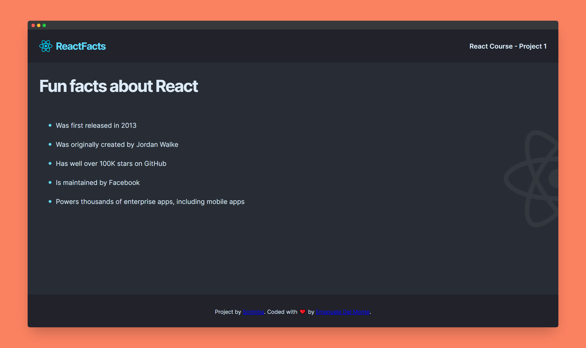

# Scrimba - Blackjack game solution

This is a solution to the [Blackjack game project on Scrimba](https://scrimba.com/learn/learnjavascript/). Scrimba helps you improve your coding skills by building realistic projects.

## Table of contents

- [Overview](#overview)
  - [The challenge](#the-challenge)
  - [Screenshot](#screenshot)
  - [Links](#links)
- [My process](#my-process)
  - [Built with](#built-with)
  - [What I learned](#what-i-learned)
  - [Continued development](#continued-development)
  - [Useful resources](#useful-resources)
- [Author](#author)
- [Acknowledgments](#acknowledgments)

## Overview

### The challenge

Users should be able to:

### Screenshot



### Links

- Solution URL: [@GitHub](https://github.com/xdelmo/blackjack-game)
- Live Site URL: [@GitHub](https://htmlpreview.github.io/?https://github.com/xdelmo/blackjack-game/blob/master/index.html)

## My process

### Built with

- Semantic HTML5 markup
- CSS custom properties
- Flexbox
- Mobile-first workflow
- Vanilla Javascript

### What I learned

With this project I improved my JS skills. The newest things I learnt are:

- How to generate a random number and floor it to eliminate the decimal part with Math.floor() and Math.random() methods

```js
let randomNumber = Math.floor(Math.random() * 13) + 1;
```

- How to add new items to the end of an array usign push() method

```js
cards.push(card);
```

### Continued development

I'd like to:

- ~~Hide buttons when you can't click on the them~~
- ~~Remove $20 to player's chips everytime he starts a new game~~
- ~~Add triple the bet to player's chips everytime he wins with Blackjack~~

### Useful resources

- [Generating random whole numbers in JavaScript in a specific range](https://stackoverflow.com/questions/1527803/generating-random-whole-numbers-in-javascript-in-a-specific-range) - How to generate a random number and floor it to eliminate the decimal part with Math.floor() and Math.random() methods
- [How do I prevent an image from overflowing a rounded corner box?](https://stackoverflow.com/questions/587814/how-do-i-prevent-an-image-from-overflowing-a-rounded-corner-box) - This helped me to hidden hero image's top corners
- [Images for the project](https://www.freepik.com/free-vector/happy-tiny-people-gambling-online-casino_9649944.htm#query=cartoon%20casino&position=1&from_view=search) - Good resource for free high quality images

## Author

- Website - [Emanuele Del Monte](https://www.emanueledelmonte.it)

## Acknowledgments

A big thank you to [Per Harald Borgen](https://github.com/perborgen) who is a pleasure to listen to and to learn new this in funny and interactive way 👏
